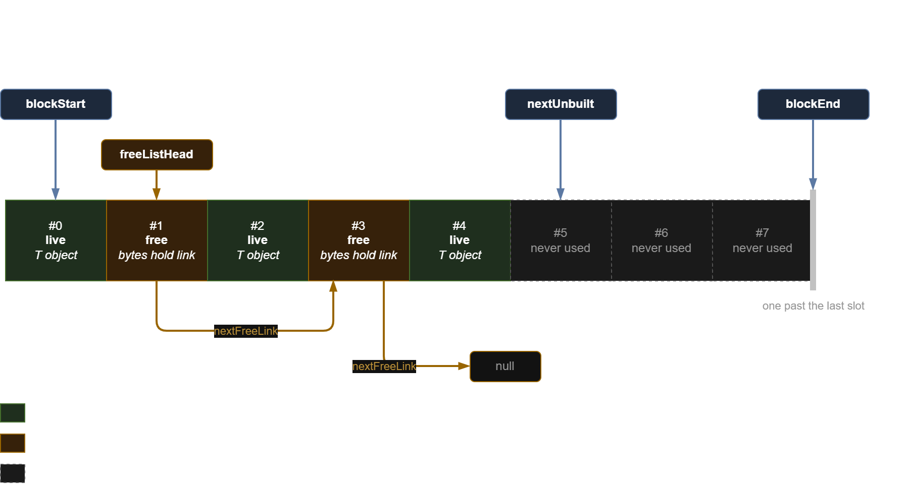
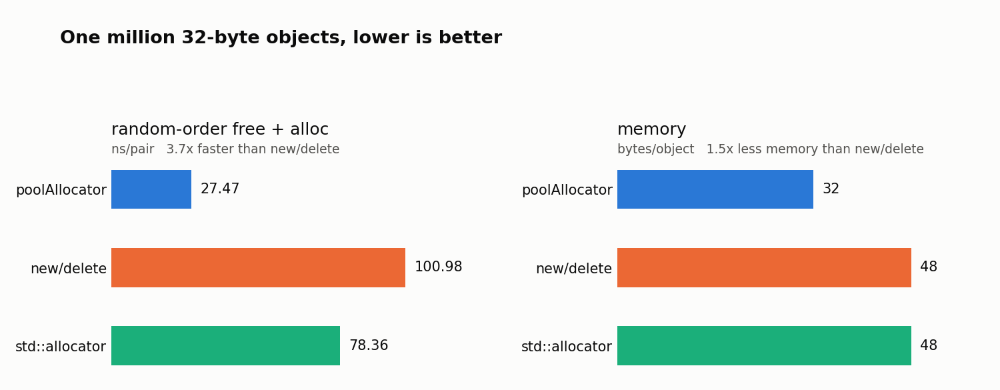

# `poolAllocator<T>`

A fixed-capacity object pool for a single type, header-only. The pool allocates one
aligned block up front; `allocate()` hands back a slot with a `T` constructed in it and
`destroy()` runs the destructor and returns the slot. Nothing else reaches the system
allocator.

## Design

The block is an array of slots. A slot is `max(sizeof(T), sizeof(void *))` bytes aligned to
`max(alignof(T), alignof(void *))`, so over-aligned types work and the free-list link always
fits. Unused slots are handed out when needed, and freed slots go onto a LIFO free list
whose links live inside the freed slots themselves, so the pool needs no extra memory. Objects never move, so a pointer
stays valid until it is destroyed, the pool is reset, or the pool dies.



A capacity-8 pool after five allocations and two frees. Green slots hold live objects, orange
slots are on the free list, grey slots have never been handed out. The free-list links live
inside the freed slots.

## Interface

```cpp
poolAllocator<T> pool(1024); // one aligned block, capacity 1024

T *p = pool.allocate(args...);// forwards args to T's constructor, nullptr when full

pool.destroy(p);            // ~T(), slot goes back on the free list
pool.reset();               // destroys every live object, rewinds to empty

pool.size();                // live objects
pool.capacity();            // slots in the block
```

`allocate()` with no arguments value-initialises. The pool is movable and not copyable; a
moved-from pool is empty (capacity 0) and still usable.

## Benchmark



| scenario | poolAllocator | new/delete | std::allocator |
| --- | --- | --- | --- |
| random-order free + alloc (ns/pair) | 27.47 | 100.98 | 78.36 |
| memory (bytes/object) | 32.0 | 48.0 | 48.0 |


**System**: 13th Gen Intel Core i7-13700H, WSL2 on Windows, g++ 11.4.0, `-O2 -std=c++20 -DNDEBUG`.

Best of 5 timed runs after one warm-up. The object is a 32-byte POD. The scenario keeps
1,000,000 objects live and walks a shuffled index sequence in batches of 64 frees followed by
64 allocations, so the free list has real depth and the addresses are scattered. Run it with
`make bench && ./bench`, and redraw the chart with `./bench | python3 chart.py`.

To measure the memory performance, the benchmark snapshots glibc's `mallinfo2`
before and after building a million objects. The pool needs one slot per object and keeps no
per-object metadata, while glibc adds an eight-byte header to every chunk and rounds the
result up to a multiple of sixteen, so a 32-byte object costs 48 bytes there..

## Limitations

- Not thread-safe. No locks, no atomics: use one pool per thread.
- Fixed capacity. `allocate()` returns `nullptr` when the block is full and the pool never
  grows.
- The destructor frees the block without destroying live objects. Call `reset()` first if
  `~T()` has to run.
- `destroy()` trusts the caller. The "came from this pool" check is an `assert`, so it is
  gone under `NDEBUG`, and double frees are not detected at all.
- `allocate()` is `noexcept`. A throwing `T` constructor terminates the program.
- `reset()` tells live slots from freed ones by walking the free list, so it costs
  O(live x freed), or O(live) when nothing was freed individually. 
